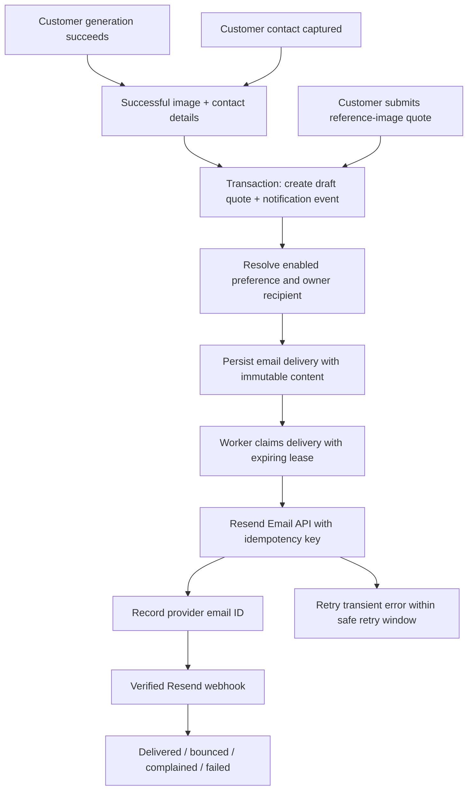

# Owner notifications

Status: deployed October 3, 2026. The production notification migration is applied and both delivery tables have RLS enabled. The existing Resend account has a verified sending domain; Production has `RESEND_API_KEY`, `NOTIFICATION_EMAIL_FROM`, `RESEND_WEBHOOK_SECRET` and a dedicated `NOTIFICATION_WORKER_SECRET`. The signed delivery webhook is registered at `https://growjewelry.io/api/webhooks/resend`. The Cloudflare scheduled-only Worker is deployed with a five-minute recovery schedule; a real scheduled run recovered a queued fictional test alert and its signed Resend webhook confirmed delivery in one attempt on October 3, 2026. The authorized test recipient received exactly one message; the fictional quote was marked closed and its delivery audit retained. See `workers/owner-notification-scheduler/README.md` and `docs/notification-capacity.md`.

## Approved behavior

- Notifications are enabled by default, including for existing Accounts after migration.
- Email is the active delivery channel. SMS is visible but disabled and labelled “Coming soon”. Existing SMS consent records must be preserved; this release does not send SMS.
- The recipient defaults to the store owner's login email. Settings allows an override; clearing the override restores the login-email default. Changing the notification address does not change the owner's login.
- Notify after a customer design has at least one successful image and captured customer contact information, even if the customer never chooses a favorite.
- Send one new-request notification per customer Request, not one per image, variant, revision, page visit, or polling response.
- Exclude work generated inside the owner's dashboard. This is the working scope assumption; no separate owner-work alert was requested.
- Include customer-uploaded reference-image quote submissions as new quote requests. Catalog edits, reviews, owner media jobs and billing events are outside this first release.
- Enabling notifications does not replay historical activity. Disabling them cancels unsent alerts; an email already accepted by Resend cannot be recalled.

## Settings section

Replace the visible `SmsNotificationSettingsForm` with one Notifications card in `/owner/settings`:

1. Heading: **Notifications**.
2. Description: “Get an email when a customer creates a design or sends a quote request through your jewelry designer.”
3. Master toggle: **Customer activity notifications**, on by default.
4. Channel rows: **Email** selected; **SMS** disabled, gray, with a **Coming soon** badge. The channel controls are also disabled when the master toggle is off.
5. Recipient field: **Notification email**. Show the effective address. Helper: “Defaults to your login email. Changing this won't change your login.” Provide **Use login email** to remove an override.
6. Helper explaining the trigger: “You'll receive one email once a design and customer contact details are available, even if the customer hasn't chosen a favorite.”
7. **Save notification settings** with pending, saved, and accessible error states. Display saved server state only after a successful response.

The Settings API derives `accountId` from `getOwnerContext()`. It does not accept an Account ID or a customer-controlled recipient. Validate the address on the server with Zod and bound its length. Reject attempts to enable SMS. Preserve all existing SMS opt-in timestamps and disclosure versions.

## Current application hooks

`src/lib/quotes/ensure-draft-quote.ts` is the shared convergence point. It creates one `QuoteRequest` for a Request with a successful Result and a Lead containing name, phone and email. Lead capture and successful generation both call it, so either ordering can become eligible.

The hook is used by name, picture, grillz, bracelet and necklace generation and by revision/lead flows. The reference-photo quote form uses a separate hook in `app/api/storefront/[accountSlug]/quote/route.ts` and must enqueue through the same notification service.

Chain-only necklace requests are intentional: they use the selected static chain reference as the quote preview and remain eligible for the same customer notification flow after contact capture. They are not treated as a failed generation case.

Customer favorite selection currently lives in browser state. The draft quote's `resultId` is an automatically selected preview, not proof of a customer's preference. V1 emails therefore say **Generated preview** and **Customer preference has not been recorded**. Persisting a favorite is a separate product change; do not infer abandonment or a chosen favorite from the draft's `resultId`.

Request `userId` is insufficient to identify owner activity: many existing flows use the `demo` ID. All five generation entrypoints now persist server-derived `Request.notificationAudience`: `owner` for an authenticated owner of the resolved Account, `customer` otherwise. Historical rows default to `legacy` and never enqueue alerts. Owner tests of their own public storefront are excluded too; test a customer flow while signed out. No client-supplied origin flag controls exclusion.

## Event and delivery architecture

Implemented storage:

| Model | Purpose and principal fields |
| --- | --- |
| `AppSetting` | Existing Account-scoped JSON preference, keyed by `{accountId}:owner_notifications_v1`: enabled, email override and SMS disabled. Missing settings default to on; malformed settings fail closed. |
| `OwnerNotification` | Combined event and email delivery: Account foreign key, scoped quote ID, kind, permanent unique `new_customer_request:{quoteId}:email` key, immutable payload/recipient, provider ID, status, attempts, next attempt, first attempt, lease token/expiry and delivery timestamps. |
| `NotificationWebhookEvent` | Unique Svix event ID, provider email ID, event type/time and processed timestamp. Handles duplicates and events arriving before the send response is persisted. |

All Account relations, unique constraints and foreign keys belong in the canonical Prisma schemas and reviewed Postgres migration. Enable RLS on new public tables without adding browser grants; access is through authenticated server routes and the worker. Preserve the archived SQLite schemas as historical sources.

Create the quote and event in one transaction. A uniqueness conflict rolls back together and returns the already-created quote. Generation completion should not fail because Resend is unavailable; only persist the event here, never call an email provider in that transaction. A notification event can have a skipped delivery when notifications are off or no active owner has a valid address.

Select the active `owner` AccountMembership and its authenticated User's email for the default recipient. The beta has one owner per Account. Never use `Lead.email`, the customer email, or arbitrary client-supplied addresses as the owner recipient.

At send time, recheck active Account/membership, enabled preference, and recipient. If the address changes before the first attempt, materialize a new payload for the current recipient. Once sending has been attempted, preserve that payload and idempotency key across retries; cancel remaining retries when the recipient changes rather than send stale customer information or silently replace the payload. Distinguish retryable provider errors from permanent address/configuration errors.

## Resend delivery

Resend is sufficient for these transactional emails. Use a verified sending domain, a server-only API key, and a Grow Jewelry display name. Prefer **Grow Jewelry <alerts@notifications.growjewelry.io>** on a dedicated sending subdomain; use **Grow Jewelry <notifications@growjewelry.io>** if the existing team has already verified the root domain for sending. Verify the exact sender/domain before activation. Configure reply-to as `support@growjewelry.io` only when that mailbox is operational.

Configuration:

- `RESEND_API_KEY`: server-only, installed through the existing account or marketplace connection.
- `NOTIFICATION_EMAIL_FROM`: verified sender address with Grow Jewelry display name.
- `RESEND_WEBHOOK_SECRET`: verifies webhook signatures.
- `NOTIFICATION_WORKER_SECRET` or `CRON_SECRET`: protects worker invocation.
- `APP_BASE_URL` / `NEXT_PUBLIC_APP_URL`: trusted deployment URL; production requires HTTPS. Do not construct email links from client-supplied Origin headers.

Use Resend's `Idempotency-Key` with the persisted delivery ID. Resend retains keys for 24 hours, so automated retries must stop safely inside that window (for example, after 23 hours from the first attempt). A provider timeout has an uncertain outcome; never retry it after the retention window with a new key. Record `needs_review` for that case. Keep database deduplication permanently.

Use a Postgres-backed worker with atomic conditional claims, expiring leases, exponential backoff and bounded batches. Nudge it after the event transaction through the existing background scheduling helper for prompt delivery; retain scheduled recovery independently of the request process. `waitUntil()` alone is not durable.

Current `vercel.json` has a daily VVS cron. Notification recovery needs an explicit schedule compatible with the actual Vercel plan (minute-level recovery if available); a daily schedule must not be described as immediate or reliable near-real-time recovery. If the plan cannot support the chosen interval, provision an authorized external scheduler or use an existing continuously running worker before activation. Keep the queue compatible with Render too.

Verify Resend webhooks against the raw body and Svix headers. Store/deduplicate the event first, reconcile against `providerMessageId`, and prevent late “sent” events from overwriting “delivered”, “bounced” or “complained”. Provider acceptance is `sent`, not `delivered`. Do not enable open/click tracking for this release.

## Email format

See [the sample email preview](owner-notification-email-preview.html) for layout review. Its customer details are fictional and its image is a style reference, not a generated customer design. Live emails link to the specific quote rather than the general dashboard.

### Generated customer design

**Subject and heading:** `New {product category} Design: Quote Request — {customer name}`

**Preheader:** `{customer name} created a design for {store name}. Review the preview and contact details.`

**From:** Grow Jewelry

For a generated design, use `New {product category} Design: Quote Request` as the prominent heading. The subtitle identifies the customer and when they submitted it.

**Body:** `{customer name} created a {product category} design through {store name}'s jewelry designer.`

- Store name and readable product category.
- Design/name text when applicable.
- Separate design, customer and request sections. Include stored style, finish, metal colors, material/karat, stones, diamond quality, size, emblem, color and chain when available. Omit absent optional specifications. Budget and price are intentionally excluded because a quote request does not yet have a price.
- Customer name, phone and email.
- Request reference, submission timestamp explicitly labelled UTC, status and notes when provided.
- Generated preview image, with meaningful alt text and no dependence on the image loading.
- **Preference:** “Customer preference has not been recorded. This is a generated preview; all available designs are in your dashboard.”
- Primary button **Review request**, linking to the authenticated `/owner/quotes/{quoteId}/prepare` page.
- Footer: “You're receiving this because customer activity notifications are enabled for {store name}.” Link **Manage notifications** to `/owner/settings`.
- Plain-text equivalent with the same information and URLs.

Escape all customer/store text. Use trusted absolute URLs for the button and Settings link. Allow only validated HTTP(S) image URLs, resolving app-relative media against the trusted base URL; omit the image when unavailable. Use a table-based, narrow email layout with inline styles and an image width cap. Match the owner dashboard: charcoal background (`#0d0e12`), dark cards (`#17191f` / `#101114`), gold (`#f7bc5f`) labels and action button, soft borders and rounded corners. Do not attach image binaries in v1.

### Uploaded reference-image quote

Use the same layout with the heading and subject `New Custom Jewelry Quote Request — {customer name}`. A reference upload is a quote request, but is not a generated design. Body: `{customer name} submitted reference images and requested a quote from {store name}.` Label the image **Customer reference image**. Include customer notes when present and omit the favorite-selection wording because it does not apply.

## Exceptions

| Situation | Result |
| --- | --- |
| Image succeeds before contact is captured | No alert yet; contact capture re-evaluates eligibility. |
| Contact arrives before generation finishes | No alert yet; first successful image re-evaluates eligibility. |
| One variant succeeds, another is pending or fails | One alert with the successful preview; dashboard shows subsequent results. |
| All variants fail or remain pending | No customer-request success alert. Failure monitoring is separate. |
| Customer closes the page after eligibility | The persisted event still sends; no reliance on the browser staying open. |
| No favorite is selected | Alert still sends; preview is explicitly not a confirmed favorite. |
| Additional variants, revisions or repeated lead submissions | Same quote/event key, no duplicate new-request alert. |
| Customer creates a genuinely new Request | A new event is eligible, even for the same customer. |
| Customer reference-image quote | One alert after the valid form and uploaded media are persisted. |
| Chain-only necklace | The selected static chain preview intentionally qualifies after customer contact capture. |
| Owner dashboard generation or Studio work | Excluded through server-derived origin. |
| Owner disables notifications | Skip new deliveries and cancel unsent/retry deliveries; already accepted mail cannot be recalled. |
| Owner enables notifications later | Future events only, no historical replay. |
| Provider unavailable | Quote remains available; queue retries transient failures. |
| Missing provider config or unverified sender | Delivery fails closed and exposes an operational error; never record success. |
| Bounce or complaint | Record terminal state and suppress automatic retries for the affected address. |
| Owner overrides email | Future sends use the override; login email remains unchanged. |

## Implementation and validation order

1. Connect Resend and verify domain/sender; confirm scheduler capabilities. Do not send real owner alerts or replay old quotes during setup.
2. Apply the reviewed Postgres migration; generation origin, preferences and delivery persistence are implemented.
3. Implement the new Settings card and Account-scoped GET/POST preference API; replace only the visible legacy SMS settings card, preserving consent data and legal evidence.
4. Wire transactional events at generated-draft and uploaded-reference quote creation; only new events after activation, no historical backfill.
5. Add versioned HTML/text formatter, worker, signed webhook and bounded retry/reconciliation behavior.
6. Test event ordering, duplicate/concurrent generation, owner exclusion, Account isolation, disabled defaults/overrides, opt-out during retry, immutable payload/idempotency, timeout expiry, webhook ordering/signatures and provider failures.
7. Run Prisma generation, TypeScript and appropriate targeted/full tests; inspect desktop/mobile Settings and a rendered email. Test actual sending only to an explicitly authorized test recipient, then confirm the provider ID and delivery webhook.

Provider references: [Resend marketplace setup](https://resend.com/docs/guides/vercel-marketplace-integration), [Resend idempotency keys](https://resend.com/changelog/idempotency-keys), [Signed webhook verification](https://www.resend.com/changelog/managing-webhooks-via-api).

## Activation runbook

1. Apply `prisma/postgres-migrations/20261002140000_add_owner_notifications.sql` once against the intended Postgres project before deploying these routes. It adds `Request.notificationAudience`, the two delivery tables, indexes and RLS with no browser grants. It does not notify historical customers.
2. Set server-only `RESEND_API_KEY`, `NOTIFICATION_EMAIL_FROM` (a chosen address on the verified domain), `RESEND_WEBHOOK_SECRET`, and `NOTIFICATION_WORKER_SECRET` in the deployment environment. Production links require a trusted HTTPS `APP_BASE_URL`.
3. In Resend, register `https://growjewelry.io/api/webhooks/resend` for `email.sent`, `email.delivered`, `email.failed`, `email.bounced`, `email.complained`, and `email.suppressed`. Save its signing secret as `RESEND_WEBHOOK_SECRET`. Preview deployments must use their own accessible webhook URL if testing there.
4. The Cloudflare scheduler invokes `POST /api/internal/notifications/process` every five minutes with Bearer authentication and `{ "limit": 5 }`. Explicit limits are restricted to 1–5; existing no-body/GET callers retain their default. The processor stops claiming new rows as its 150-second time budget runs low. The immediate nudge remains active. Cloudflare holds only the dedicated processor secret, with no database or Resend credentials. No paid plan was purchased. See the scheduler README for deployment and rollback.
5. Deploy, then exercise a signed-out customer design with an explicitly authorized test recipient. Confirm the quote, one delivery ID, provider acceptance and a signed delivered webhook. Also check opt-out and missing-favorite behavior. No real email has been sent during local implementation.

Local verification: Prisma generation, TypeScript and production builds passed; 481 application tests passed with 5 skipped, plus 28 scheduler runtime tests. The migration was applied to an isolated PostgreSQL-compatible PGlite database to verify historical defaults, deduplication, Account foreign keys and RLS browser-role denial. Production migration/schema/RLS are verified. Scheduler runtime tests (28) and disposable Postgres concurrency/crash recovery tests pass. Live scheduled delivery is verified: one processing attempt, provider acceptance, and reconciled signed email.sent/email.delivered events.
