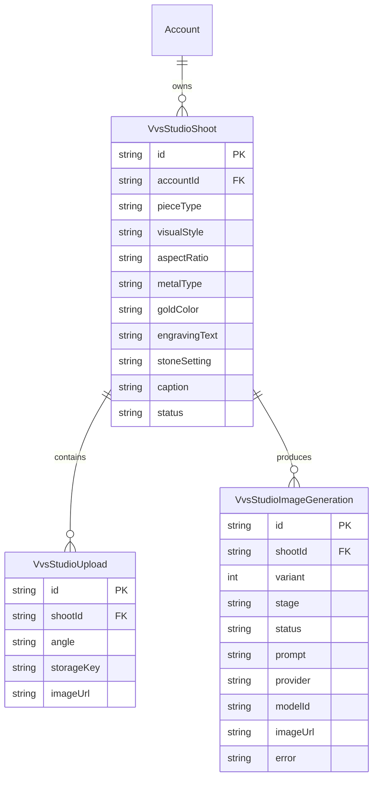

# VVS Studio image generation

## Product flow

```text
Capture
  -> Details
  -> Theme
  -> Generate image 1
  -> Poll image 1
  -> Results (image 1 selected)
       |-- edit or auto-generate a local caption
       |-- open selected image
       `-- Generate image 2 or 3
             -> Poll next image
             -> Results (new image appended and selected)
```

Image generation stops after the result gallery. Unlike the video flow, it does not finalize an image and continue into video generation. A shoot/post can have one to three successful `studio_post` image generations.

## Data model



No new table is required for additional images. All outputs are `VvsStudioImageGeneration` rows attached to one `VvsStudioShoot`:

| Field | First output | Second output |
| --- | --- | --- |
| `stage` | `studio_post` | `studio_post` |
| `variant` | `1` | `2` |
| `status` | `pending`, `succeeded`, or `failed` | `pending`, `succeeded`, or `failed` |

A third output uses the same stage with `variant = 3`. `VvsStudioShoot.caption` stores the optional post caption, while the remaining shoot fields store the generation inputs.

Legacy successful `style_composite` images are grouped into the same shoot/post so pre-migration Studio content remains visible and counts toward the three-image maximum.

The optional caption is persisted on `VvsStudioShoot`. It is shared by every image in the post and can be edited from either the generation result or the persistent post dialog. Future channel-specific publishing state should use a dedicated publication model rather than being attached to an image generation row.

## API structure

### Initial setup

1. `POST /api/owner/vvs-studio/shoots`
   Creates the account-scoped shoot.
2. `POST /api/owner/vvs-studio/shoots/:shootId/uploads`
   Stores each source angle.
3. `PATCH /api/owner/vvs-studio/shoots/:shootId`
   Saves piece, style, format, and material details.

### Generate either output

`POST /api/owner/vvs-studio/shoots/:shootId/generate`

- Resolves the next `studio_post` variant server-side.
- Rejects a request while another `studio_post` generation is pending.
- Rejects a request after three successful outputs.
- Creates a pending `VvsStudioImageGeneration` row.
- Starts provider work through `scheduleBackgroundTask`.
- Returns `201 { generationId }` immediately.

### Poll generation

`GET /api/owner/vvs-studio/generations/:generationId`

```json
{
  "generationId": "...",
  "status": "pending | succeeded | failed",
  "imageUrl": "https://...",
  "error": null
}
```

The client polls every 2.5 seconds. A successful second generation is appended to the existing gallery; it does not replace the first image.

## Constraints

- Owner context scopes every shoot and generation query to `accountId`.
- Each generation consumes one `vvs_product_post_generated` usage credit only after success.
- Provider prompts and exact model IDs remain stored per generation.
- The second output reuses the same shoot inputs and prompt settings, while provider sampling supplies the alternate composition.
- Production background execution continues to use `scheduleBackgroundTask`, which delegates to the platform-safe background mechanism.
