# VVS Studio multi-step image pipeline architecture

## Decision

Build the image-post workflow as a durable, database-backed dependency graph:

```text
raw top-view upload
        |
        v
source_cleanup (private intermediate master)
        |
        v
style_composite + versioned background asset
        |
        +----------------------+
        |                      |
        v                      v
hero_shot (post image 1)   macro_right (post image 2)
        |
        v
alternate_angle (optional post image 3)
```

The practical initial graph should be:

```text
raw -> source_cleanup -> hero_shot -> macro_right
                                  `-> alternate_angle
```

`macro_right` and `alternate_angle` should branch from `hero_shot`, not chain image 1 -> image 2 -> image 3. Every edit introduces identity drift. Branching preserves the established scene while preventing the third image from inheriting two generations of accumulated errors.

The first two stages are required. Additional publishable shots are optional: a post is usable after `hero_shot` succeeds even if a detail shot fails.

## Requested stage mapping

| Stage | Inputs | Model/profile | Output | User-visible |
| --- | --- | --- | --- | --- |
| `source_cleanup` | Raw top-view upload | `openai/gpt-image-2/edit`, medium, 1k | Clean canonical jewelry master | No |
| `hero_shot` | Clean master + product/style background | `nano-banana-2/edit-fast` | Styled studio hero | Yes, image 1 |
| `macro_right` | Hero shot | `openai/gpt-image-2/edit` | 50-degree macro detail | Yes, image 2 |
| `alternate_angle` | Hero shot | Versioned edit profile | Optional third angle | Yes, image 3 |

Product type and color theme must be separate configuration dimensions:

```text
styleKey = prisma
productType = pendant
environmentKey = prisma_pendant_v1
colorTheme = derived_from_style
backgroundArtifactId = ...
placementPromptVersion = ...
```

This avoids using one pendant environment for rings, chains, or grills while still sharing a coherent color theme. V1 only needs pendant environments, but `productType` remains part of environment lookup so later product types do not require a schema or orchestration redesign. Color theme is derived from `styleKey`; it is not an independently selectable configuration dimension.

## How image posts work now

The current standalone image path is not multi-step:

1. `POST /api/owner/vvs-studio/shoots/:shootId/generate` creates one `VvsStudioImageGeneration` with `stage = studio_post`.
2. The background task reads the original uploads.
3. One provider call receives the raw uploads and one combined prompt.
4. Its output is downloaded to durable storage and added directly to the post.
5. A second or third image repeats the same process independently from the raw uploads. It does not consume the preceding output.

This is simple, but it cannot guarantee scene continuity or expose progress by cleanup/composition/camera stage.

The repository already has a sequential engine for video generation:

```text
VvsStudioJob
  source_refine
    -> style_composite
      -> last_shot
        -> video
```

Each image stage creates a `VvsStudioImageGeneration` and links to its immediate predecessor through `sourceImageGenerationId`. The worker submits or polls one provider job, persists provider metadata, saves successful output to R2, advances `currentStage`, and retries failures.

That engine is the correct starting point, but it is currently video-specific and has four limitations for image posts:

- `VvsStudioJob.currentStage` describes only one cursor, not a branching graph.
- `sourceImageGenerationId` supports one predecessor, while composition needs multiple inputs (clean master plus background).
- stage attempts and output artifacts are combined in `VvsStudioImageGeneration`.
- the cron currently runs once daily, while provider polling is released after roughly ten seconds. A durable pipeline needs immediate/delayed continuation, not a daily safety net.

## Target data model

Keep `VvsStudioShoot` as the user-facing post aggregate and introduce explicit execution, step, artifact, and dependency records.

```mermaid
erDiagram
  VvsStudioShoot ||--o{ VvsStudioPipelineRun : runs
  VvsStudioPipelineRun ||--o{ VvsStudioPipelineStep : contains
  VvsStudioPipelineStep ||--o{ VvsStudioStepInput : consumes
  VvsStudioMediaArtifact ||--o{ VvsStudioStepInput : supplied_as
  VvsStudioPipelineStep ||--o| VvsStudioMediaArtifact : produces

  VvsStudioPipelineRun {
    string id PK
    string accountId FK
    string shootId FK
    string kind
    string definitionKey
    string definitionVersion
    string status
    string configSnapshotJson
    string idempotencyKey
    datetime startedAt
    datetime completedAt
    string error
  }

  VvsStudioPipelineStep {
    string id PK
    string runId FK
    string stageKey
    int ordinal
    string status
    int attempt
    int maxAttempts
    string prompt
    string promptVersion
    string provider
    string modelId
    string paramsJson
    string providerJobId
    string providerPayloadJson
    datetime runAfter
    datetime lockedAt
    string lockedBy
    datetime startedAt
    datetime completedAt
    int durationMs
    string error
  }

  VvsStudioMediaArtifact {
    string id PK
    string accountId FK
    string shootId FK
    string runId FK
    string producingStepId FK
    string kind
    string role
    boolean publishable
    string storageKey
    string storageVisibility
    string mimeType
    int width
    int height
    int fileSize
    string checksum
    datetime createdAt
  }

  VvsStudioStepInput {
    string stepId FK
    string artifactId FK
    string role
    int ordinal
  }
```



Recommended statuses:

- Run: `queued | running | partially_succeeded | succeeded | failed`
- Step: `blocked | queued | submitting | polling | saving | succeeded | failed`
- Artifact kinds: `raw_upload | background_reference | intermediate | final_image`
- Artifact roles: `raw_top | clean_master | environment | hero | macro_right | alternate_angle`

### Why not keep only `VvsStudioImageGeneration`?

It can support a short linear prototype, but it conflates a provider attempt with a durable image artifact and cannot represent multiple typed inputs cleanly. Keep existing rows for compatibility and monitoring during migration, but new orchestration should use explicit steps and artifacts. A successful final artifact may be mirrored into the existing post image relation until all UI queries migrate.

## Pipeline definition and prompt ownership

Stage definitions must be versioned configuration, not hard-coded route logic:

```yaml
key: vvs_image_post
version: 2026-06-21.1
stages:
  - key: source_cleanup
    profile: source_cleanup_gpt_image_2_v1
    inputs: [raw_top]
    output: clean_master
    required: true
  - key: hero_shot
    profile: hero_nano_banana_2_v1
    inputs: [clean_master, environment]
    output: hero
    publishable: true
    required: true
  - key: macro_right
    profile: macro_right_gpt_image_2_v1
    inputs: [hero]
    output: macro_right
    publishable: true
  - key: alternate_angle
    profile: alternate_angle_gpt_image_2_v1
    inputs: [hero]
    output: alternate_angle
    publishable: true
```

Store editable prompt templates outside TypeScript, for example:

```text
src/lib/vvs-studio/pipelines/vvs_image_post/pipeline.yml
src/lib/vvs-studio/pipelines/vvs_image_post/source_cleanup.jsonp
src/lib/vvs-studio/pipelines/vvs_image_post/hero_shot.jsonp
src/lib/vvs-studio/pipelines/vvs_image_post/macro_right.jsonp
src/lib/vvs-studio/environments/<style>/<product>/environment.yml
```

At run creation, snapshot the pipeline version, resolved model, parameters, prompt version, environment artifact ID, and exact rendered prompt. Later config edits must never change an in-flight or historical run.

### Dynamic model selection

Models are stage-level configuration, not pipeline code. An administrator must be able to change the active provider/model/profile independently for `source_cleanup`, `hero_shot`, `macro_right`, and `alternate_angle` without changing routes, orchestration, storage, schemas, or other stages.

```text
logical stage -> active profile -> provider adapter + model ID + parameters
```

Changing a profile affects only runs created after the change. Every run snapshots the resolved profile ID/version, provider, model ID, parameters, and exact prompt before work begins. In-flight runs continue with their snapshot, and historical runs remain reproducible. Provider-specific behavior stays behind adapters implementing the same submit/poll/result contract.

## Storage architecture

Every provider output must be downloaded immediately. Provider URLs are temporary references, not application storage.

Recommended R2 keys:

```text
vvs-studio/accounts/{accountId}/shoots/{shootId}/uploads/{uploadId}.jpg
vvs-studio/accounts/{accountId}/runs/{runId}/source_cleanup/{stepId}.png
vvs-studio/accounts/{accountId}/runs/{runId}/hero_shot/{stepId}.png
vvs-studio/accounts/{accountId}/runs/{runId}/macro_right/{stepId}.png
vvs-studio/accounts/{accountId}/runs/{runId}/alternate_angle/{stepId}.png
vvs-studio/environments/{styleKey}/{productType}/{version}.png
```

Storage policy:

- Raw uploads: private R2.
- Intermediate clean master: private R2.
- Environment assets: versioned, immutable; public only if providers need public URLs.
- Publishable final images: durable public R2 URL, or private with signed delivery if the product later requires it.
- Provider remote URL: metadata only, never the canonical URL.
- Store checksum, dimensions, MIME type, and file size after download.
- Retain intermediate artifacts for 90 days, then delete them through a lifecycle/cleanup job if the run is terminal and no retry or investigation hold exists.
- Raw uploads and publishable final images follow the post's retention lifecycle rather than the 90-day intermediate policy.

Providers that accept only URLs should receive a short-lived signed GET URL or a temporary provider-input copy. Do not make private raw uploads permanently public.

## Execution model

### Start

`POST /api/owner/vvs-studio/shoots/:shootId/image-pipelines`

In one transaction:

1. Validate owner/account, required top upload, style, product environment, and usage availability.
2. Create a run with an idempotency key.
3. Snapshot pipeline/profile/environment configuration.
4. Create all steps as `blocked` except dependency-free steps as `queued`.
5. Create input artifact rows for raw uploads and the selected environment.
6. Return `202 { runId }`.

Do not perform provider work in this request.

### Worker

A worker atomically claims one runnable step:

```text
queued + runAfter <= now + dependencies succeeded + unlocked
```

Then:

1. Resolve typed input artifacts.
2. Render or load the snapshotted exact prompt.
3. Submit the provider job once and persist `providerJobId`.
4. If asynchronous, set `polling` and schedule delayed continuation.
5. Poll by the stored provider job ID; never resubmit an already-submitted attempt.
6. Download successful output to R2.
7. Create the artifact row and mark the step succeeded transactionally.
8. Queue newly unblocked child steps.
9. Recompute run status.

Use at-least-once execution with idempotent state transitions. A duplicate worker delivery must observe the existing provider job/output and do no duplicate billable work.

### Durable continuation

Do not rely on `void Promise`, one request-scoped `waitUntil`, or the current daily cron as the primary executor.

Preferred order:

1. A durable workflow runtime that supports sleep/resume and retries.
2. A durable queue with delayed messages per step/poll.
3. As a compatible interim solution, the existing Postgres queue plus an immediate nudge and a worker scheduled at least every minute—not daily.

The cron is a recovery sweep, not the normal ten-second polling mechanism.

## Retry and failure semantics

- Retry the failed step, not the entire run.
- Preserve every successful artifact and provider attempt.
- Exponential retry only for transient provider/network failures.
- Do not retry validation, safety, malformed-input, or unsupported-model failures automatically.
- `source_cleanup` failure: run fails; all children remain blocked.
- `hero_shot` failure: run fails; no post image exists.
- optional detail-shot failure: run becomes `partially_succeeded`; the hero remains usable and visible.
- User retry creates a new step attempt linked to the failed logical step; it does not overwrite history.

## Quality gates

Before unblocking the next step, validate:

- output exists and can be downloaded;
- MIME type is an allowed image type;
- dimensions and aspect ratio are plausible;
- file is not empty/corrupt;
- provider result is not a moderation/error placeholder.

Recommended later gates:

- OCR/spelling comparison for engraved text;
- product-identity similarity between raw, clean master, and final shots;
- background/environment classification;
- optional manual review can be designed later if product requirements change; it is not part of v1.

Quality-gate results belong in structured step metadata and the internal VVS generation monitor.

## API and UI read model

```text
POST /api/owner/vvs-studio/shoots/:shootId/image-pipelines
GET  /api/owner/vvs-studio/image-pipelines/:runId
GET  /api/owner/vvs-studio/image-pipelines/:runId/events (optional SSE later)
```

Poll response:

```json
{
  "runId": "...",
  "status": "running",
  "steps": [
    { "key": "source_cleanup", "status": "succeeded", "progress": 100 },
    { "key": "hero_shot", "status": "polling", "progress": null },
    { "key": "macro_right", "status": "blocked", "progress": 0 }
  ],
  "images": [
    { "role": "hero", "url": "...", "artifactId": "..." }
  ],
  "error": null
}
```

The UI should display stage-level progress. As soon as the hero artifact exists, show it in the persistent post dialog. Additional successful final artifacts append progressively. Intermediate cleanup images stay hidden from customer-facing UI but remain visible in `/internal/vvs-generations`.

## Usage and billing

Customer billing is one post credit per pipeline run, regardless of whether the post produces one, two, or three publishable images. Consume the post credit exactly once when the required `hero_shot` succeeds, using a unique ledger key based on `runId`. Optional detail branches do not consume additional customer credits.

Separately track internal provider cost and usage per step attempt, including failed attempts when the provider charged for them. This internal cost ledger does not change customer billing.

Use `accountId:vvs_product_post_generated:run:{runId}` as the customer usage idempotency key. Use step-attempt identifiers only for internal provider-cost events so at-least-once workers cannot double-record either ledger.

## Observability

The internal monitor should add run-centric views alongside individual generation jobs:

- run status and elapsed time;
- dependency graph;
- step attempts and retry counts;
- typed input/output artifacts;
- exact prompt/model/params snapshot;
- provider job IDs and redacted payloads;
- time spent queued, submitting, polling, downloading, and total duration;
- quality-gate results;
- cost/usage event IDs.

Emit structured logs with `accountId`, `shootId`, `runId`, `stepId`, `stageKey`, `attempt`, and `providerJobId`.

## Migration plan

1. **Operational prerequisite:** fix worker cadence/durable continuation before routing paid image posts through the pipeline.
2. Externalize the three supplied prompts and define versioned stage profiles/environments.
3. Add pipeline run, step, artifact, and step-input models to both Prisma schemas.
4. Implement the generic claim/submit/poll/save/unblock state machine by extracting reusable logic from `src/lib/vvs-studio/pipeline.ts`.
5. Add the image-pipeline start and status endpoints.
6. Run in shadow mode with seeded/local artifacts so UI and orchestration can be tested without provider spend.
7. Enable only `source_cleanup -> hero_shot` for an internal account.
8. Compare product identity and spelling against the current one-shot flow.
9. Enable `macro_right`, then the optional third branch.
10. Switch the owner image flow from `/generate` to `/image-pipelines` behind a feature flag.
11. Keep the old endpoint for rollback until historical and in-flight jobs complete.

## Locked product decisions

- Provider and model are dynamically selectable per stage through versioned profiles.
- Profile changes never mutate in-flight or historical runs.
- Customer billing is one credit per post/run, not per generated image.
- Intermediate artifacts are retained for 90 days.
- V1 supports pendant environments, while the architecture remains product-type aware.
- Color theme is derived from style and is not independently configurable.
- Cancellation is not part of the workflow or API.
- Manual review is outside v1.

## Rejected alternatives

### One long API request

Rejected because a three-model chain can exceed request limits, cannot survive restarts cleanly, and forces the customer to restart from step one after a late failure.

### Only `waitUntil(Promise.all(...))`

Rejected because the stages are dependent rather than parallel, provider jobs are asynchronous, and request-scoped continuation is not a durable queue.

### Repeated standalone `/generate` calls

Rejected because each call starts from raw inputs, does not preserve the same scene, and cannot represent stage progress or dependency failures.

### Fully linear image 1 -> image 2 -> image 3

Rejected because visual/identity errors compound at every edit. Use a canonical cleanup master and branch additional shots from the first styled hero.

## Implementation boundary

This document defines the architecture; it does not switch production image generation. The first implementation should cover models, orchestration, storage, worker cadence, and a seeded no-provider test path before any paid provider calls are enabled.
