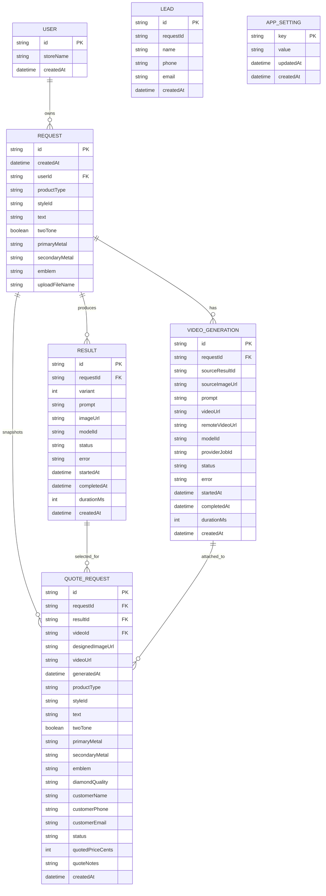
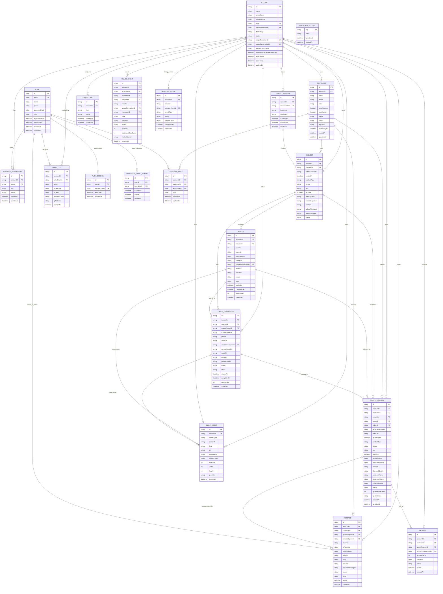
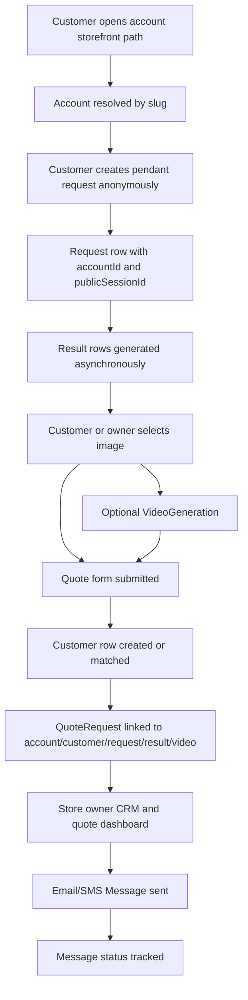
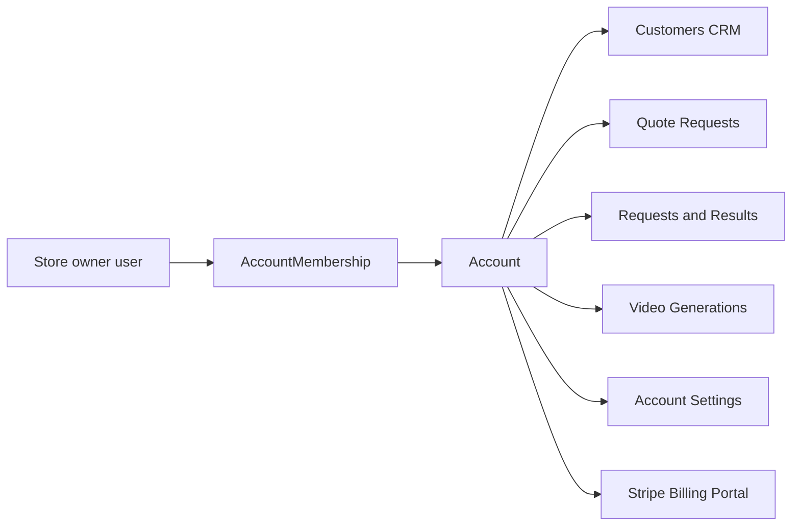

# Data Model Diagrams

This document shows the current MVP data model and the proposed multi-account SaaS data model.

Format: Mermaid ER diagrams. GitHub renders these directly in Markdown, and the code blocks can also be pasted into https://mermaid.live.

## Current MVP Model

This is the model that exists in `prisma/schema.prisma` today. It is single-store and still uses a `User` row as the store/demo owner.

Current model gaps:

- `Lead` is not relationally connected to `Request`.
- `VideoGeneration.sourceResultId` stores a result id but has no Prisma relation today.
- `AppSetting` is global.
- There is no real auth model.
- There is no tenant/account boundary.
- Store owners and SaaS admin are not separate identities.
- Customers are stored only as snapshots on quote requests or loose lead rows.

## Target SaaS Model

This is the proposed complete model for the subscription SaaS version. The tenant is named `Account`.

## Target Ownership Rules

SaaS admin:

- Can read all accounts and all account-scoped data.
- Can monitor all provider usage and failures.
- Can disable accounts.
- Can inspect customer PII only through an intentional support/admin surface.
- Should generate `AUDIT_LOG` records for sensitive cross-account actions.

Store owner:

- Belongs to exactly one `Account` in v1.
- Can only read/write data where `accountId` matches their membership.
- Cannot edit prompt/model internals.
- Can manage their account branding, customers, quotes, videos, and billing portal.

Customer:

- Has no login in v1.
- Is anonymous until form/quote submission.
- Becomes a `Customer` record after submitting name, phone, email, or quote details.

## Subscription-Only Billing Model

Billing is subscription-only.

Do not add plan details, credit packages, overage billing, or included-credit fields yet.

Required billing fields on `Account`:

- `stripeCustomerId`
- `stripeSubscriptionId`
- `subscriptionStatus`
- `subscriptionCurrentPeriodEnd`
- `trialEndsAt`

Subscription status should gate store-owner access and expensive actions. Stripe webhooks should be the source of truth.

`USAGE_EVENT` is for SaaS admin monitoring and provider-cost visibility, not customer-facing credit accounting.

## App Setting Scope

Current `AppSetting` is global. Target `APP_SETTING` is account-scoped by default.

Some future settings may be platform-global, such as SaaS-admin model defaults. If needed, add a separate `PLATFORM_SETTING` table rather than mixing global and account rows in one ambiguous table.

## Media Strategy

Today:

- Images and downloaded videos are served from `/generated/:file`.
- Files live under `GENERATED_IMAGE_DIR`.

Target:

- Store all generated images, videos, uploaded logos, and future uploads as `MEDIA_ASSET` rows.
- `MEDIA_ASSET.accountId` enforces ownership.
- `url` is the public or signed URL the app displays.
- `storageKey` is the object-storage key for deletion/reprocessing.
- `ownerType` and `ownerId` attach media to `Result`, `VideoGeneration`, `Account`, etc.

## Request And Quote Lifecycle

## Owner Dashboard Data Boundaries

Every box after `Account` must be filtered by `accountId`.

## Migration Map From Current To Target

| Current model | Target model | Notes |
| --- | --- | --- |
| `User` | `User` + `Account` + `AccountMembership` | Current `User.storeName` becomes `Account.name`. |
| `Request.userId` | `Request.accountId`, optional `Request.customerId` | Store ownership moves from user to account. |
| `Lead` | `Customer` | Replace loose lead records with account-scoped CRM records. |
| `QuoteRequest.customerName/email/phone` | `Customer` plus quote snapshot fields | Keep snapshot fields for historical quote accuracy. |
| `Result.imageUrl` | `Result.imageUrl` plus optional `MediaAsset` | Preserve direct URL while adding media ownership. |
| `VideoGeneration.videoUrl` | `VideoGeneration.videoUrl` plus optional `MediaAsset` | Preserve local/display URL while adding media ownership. |
| `AppSetting` | account-scoped `AppSetting` | Prompt mode may be account-scoped later, but prompt/model control remains SaaS-admin-only for now. |
| none | `UsageEvent` | Adds provider-cost monitoring without billing credits. |
| none | `Message` | Required for real SMS/email quote follow-up. |
| none | `Payment` | Future quote deposit/payment tracking. |
| none | `AuditLog` | Required before serious SaaS admin support tooling. |
| none | `PublicSession` | Tracks anonymous customer sessions before form submission. |
| none | `WebhookEvent` | Stores Stripe/email/SMS webhook events for idempotent processing. |
| none | `AuthSession` / `PasswordResetToken` | Required for real owner/admin auth. |
| none | `PlatformSetting` | Keeps SaaS-admin global settings separate from account settings. |

## Implementation Notes

- Add `accountId` to child tables early and index it everywhere.
- Add compound indexes for common owner queries, such as `(accountId, createdAt)`, `(accountId, status)`, and `(accountId, customerId)`.
- Keep quote snapshot fields even after adding `Customer`; quotes should preserve what the customer submitted at that time.
- Do not let store owners edit prompt templates or model ids.
- Use path-based routing first. Custom domains can come later.
- Prefer append-only logs for usage, messages, payments, and audit records.
- Keep subscription billing separate from usage monitoring.
